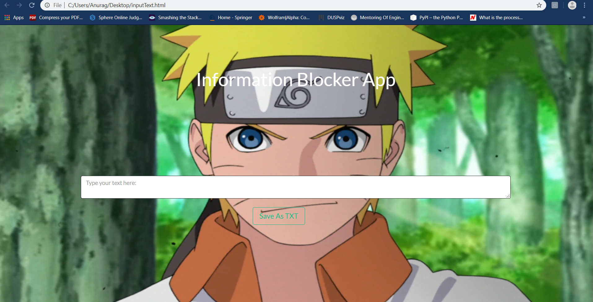

# ChromeExtension Information Hider
* Chrome Extension for Information Hider But For any Input By User in the INPUT.html
* Ask user its choice of spoiler hider 
* Saves File in txt format .
* Unpack this Extension in Chrome 
* hide-spoiler.js then read from the text and blocks all things in your web browser
* Inspired by rachitiitr
 # Working 

